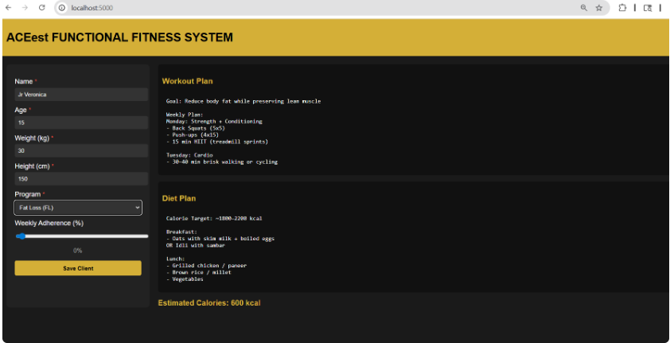

<<<<<<< HEAD
#  ACEest Fitness & Gym — Automated CI/CD Pipeline


> A production-grade DevOps implementation for ACEest Fitness & Gym — a rapidly scaling startup. This project demonstrates a complete CI/CD lifecycle using Flask, Docker, Pytest, GitHub Actions, and Jenkins.

---

## Table of Contents

- [Project Overview](#-project-overview)
- [Repository Structure](#-repository-structure)
- [Local Setup & Execution](#-local-setup--execution)
- [Running Tests Manually](#-running-tests-manually)
- [Docker Usage](#-docker-usage)
- [GitHub Actions Pipeline](#-github-actions-pipeline)
- [Jenkins Integration](#-jenkins-integration)
- [CI/CD Architecture Overview](#-cicd-architecture-overview)
- [Contributing](#-contributing) 

---

##  Project Overview

ACEest Fitness & Gym required a robust automated deployment workflow ensuring:

-  **Code integrity** through automated testing
-  **Environmental consistency** via Docker containerization
-  **Rapid delivery** through fully automated CI/CD pipelines

The solution transitions the application through a complete lifecycle — from local development → automated testing → containerized build → Jenkins quality gate → production-ready deployment.

---

##  Repository Structure

```
aceest-fitness-gym/
│
├── app.py                        # Core Flask application
├── requirements.txt              # Python dependencies
│
├── tests/
│   └── test_app.py               # Pytest unit test suite
│
├── Dockerfile                    # Docker image definition
├── .dockerignore                 # Files excluded from Docker build
│
├── Jenkinsfile                   # Jenkins pipeline configuration
│
├── .github/
│   └── workflows/
│       └── main.yml              # GitHub Actions CI/CD workflow
│
└── README.md                     # Project documentation (you are here)
```

---

##  Local Setup & Execution

### Prerequisites

Ensure the following are installed on your machine:

| Tool | Version | Download |
|------|---------|----------|
| Python | 3.11+ | [python.org](https://python.org) |
| pip | Latest | Bundled with Python |
| Docker | Latest | [docker.com](https://docker.com) |
| Git | Latest | [git-scm.com](https://git-scm.com) |

---

### Step 1 — Clone the Repository

```bash
git clone https://github.com/<your-username>/aceest-fitness-gym.git
cd aceest-fitness-gym
```

### Step 2 — Create a Virtual Environment

```bash
# Create virtual environment
python -m venv venv

# Activate (Linux/macOS)
source venv/bin/activate

# Activate (Windows)
venv\Scripts\activate
```

### Step 3 — Install Dependencies

```bash
pip install -r requirements.txt
```

### Step 4 — Run the Flask Application

```bash
python app.py
```

The application will be available at: **`http://localhost:5000`**

---

##  Running Tests Manually

The project uses **Pytest** for unit testing. All test files are located in the `tests/` directory.

### Run All Tests

```bash
pytest tests/ -v
```

### Run Tests with Coverage Report

```bash
pip install pytest-cov
pytest tests/ -v --cov=app --cov-report=term-missing
```

### Sample Expected Output

```
========================= test session starts ==========================
platform linux -- Python 3.11.x, pytest-7.x.x
collected 5 items

tests/test_app.py::test_home_route                PASSED        [ 20%]
tests/test_app.py::test_members_endpoint          PASSED        [ 40%]
tests/test_app.py::test_classes_endpoint          PASSED        [ 60%]
tests/test_app.py::test_health_check              PASSED        [ 80%]
tests/test_app.py::test_invalid_route             PASSED        [100%]

========================== 5 passed in 0.52s ===========================
```

---

##  Docker Usage

### Build the Docker Image

```bash
docker build -t aceest-fitness-gym:latest .
```

### Run the Container

```bash
docker run -d -p 5000:5000 --name aceest-app aceest-fitness-gym:latest
```

Visit: **`http://localhost:5000`**

### Run Tests Inside the Container

```bash
docker run --rm aceest-fitness-gym:latest pytest tests/ -v
```

### Stop and Remove the Container

```bash
docker stop aceest-app
docker rm aceest-app
```

---

##  GitHub Actions Pipeline

The CI/CD pipeline is defined in **`.github/workflows/main.yml`** and triggers automatically on every `push` or `pull_request` to any branch.

### Pipeline Stages

```
Push / Pull Request
       │
       ▼
┌─────────────────────┐
│  1. Build & Lint    │  — Install deps, check syntax with flake8
└────────┬────────────┘
         │
         ▼
┌─────────────────────┐
│  2. Docker Build    │  — Build Docker image from Dockerfile
└────────┬────────────┘
         │
         ▼
┌─────────────────────┐
│  3. Automated Tests │  — Run Pytest suite inside the container
└─────────────────────┘
```

### Workflow Configuration (`.github/workflows/main.yml`)

```yaml
name: ACEest Fitness CI/CD Pipeline

on:
  push:
    branches: ["**"]
  pull_request:
    branches: ["**"]

jobs:
  build-and-test:
    runs-on: ubuntu-latest

    steps:
      - name: Checkout Code
        uses: actions/checkout@v3

      - name: Set up Python
        uses: actions/setup-python@v4
        with:
          python-version: "3.11"

      - name: Install Dependencies & Lint
        run: |
          pip install -r requirements.txt
          pip install flake8
          flake8 app.py --max-line-length=120

      - name: Build Docker Image
        run: docker build -t aceest-fitness-gym:latest .

      - name: Run Tests in Docker Container
        run: docker run --rm aceest-fitness-gym:latest pytest tests/ -v
```

### Pipeline Status

Every successful pipeline run confirms:
- The application builds without errors
- The Docker image assembles cleanly
- All unit tests pass inside the containerized environment

---

##  Jenkins Integration

Jenkins handles the **BUILD quality gate** — a secondary validation layer that ensures the codebase integrates correctly in a controlled build environment.

### Jenkins Setup (Local)

1. **Install Jenkins** from [jenkins.io](https://www.jenkins.io/download/)
2. Install the following plugins:
   - Git Plugin
   - Pipeline Plugin
   - Docker Pipeline Plugin

### Jenkins Pipeline Configuration

The project includes a `Jenkinsfile` at the root. To configure:

1. Open Jenkins Dashboard → **New Item**
2. Select **Pipeline** → Enter project name → Click **OK**
3. Under **Pipeline → Definition**, select `Pipeline script from SCM`
4. Set SCM to **Git** and provide your repository URL
5. Set branch to `main` (or your default branch)
6. Click **Save** → **Build Now**

### Jenkinsfile Overview

```groovy
pipeline {
    agent any

    stages {
        stage('Checkout') {
            steps {
                git branch: 'main', url: 'https://github.com/<your-username>/aceest-fitness-gym.git'
            }
        }

        stage('Install Dependencies') {
            steps {
                sh 'pip install -r requirements.txt'
            }
        }

        stage('Build Docker Image') {
            steps {
                sh 'docker build -t aceest-fitness-gym:latest .'
            }
        }

        stage('Run Tests') {
            steps {
                sh 'docker run --rm aceest-fitness-gym:latest pytest tests/ -v'
            }
        }
    }

    post {
        success {
            echo 'BUILD SUCCESSFUL — All stages passed.'
        }
        failure {
            echo ' BUILD FAILED — Check logs above.'
        }
    }
}
```

---

##  CI/CD Architecture Overview

```
Developer Workstation
        │
        │  git push
        ▼
┌───────────────────┐
│     GitHub        │
│  Remote Repo      │◄─── Pull Requests
└────────┬──────────┘
         │  Webhook trigger
         ├────────────────────────────────────────────┐
         ▼                                            ▼
┌──────────────────────────────────┐    ┌─────────────────────────┐
│      GitHub Actions              │    │        Jenkins           │
│                                  │    │                          │
│  Stage 1: Build & Lint           │    │  Stage 1: Checkout       │
│  Stage 2: Docker Image Build     │    │  Stage 2: Install Deps   │
│  Stage 3: Pytest (in container)  │    │  Stage 3: Docker Build   │
│                                  │    │  Stage 4: Run Tests      │
└──────────────────────────────────┘    └─────────────────────────┘
         │                                            │
         └──────────────┬─────────────────────────────┘
                        ▼
               All Gates Passed
               Ready for Deployment
```

### Key Design Decisions

| Decision | Rationale |
|----------|-----------|
| Flask | Lightweight, production-proven Python web framework |
| Docker | Eliminates environment inconsistency across dev/test/prod |
| Pytest | Industry-standard Python testing framework with rich plugin support |
| GitHub Actions | Native CI integration with zero additional infrastructure |
| Jenkins | Independent build server providing a secondary validation quality gate |

---

## Contributing

1. Fork the repository
2. Create your feature branch: `git checkout -b feature/your-feature-name`
3. Commit your changes: `git commit -m "feat: add meaningful description"`
4. Push to the branch: `git push origin feature/your-feature-name`
5. Open a Pull Request

Please ensure all tests pass and the Docker build succeeds before submitting a PR.

---

##  Author

**ACEest Fitness & Gym — Junior DevOps Engineer**

---

=======
# ACE_Fitness_System
ACE_Fitness_System with docker jenkins pipeline
>>>>>>> ebe3e3c16637256510b6d94b5c66a2d88263f63d
